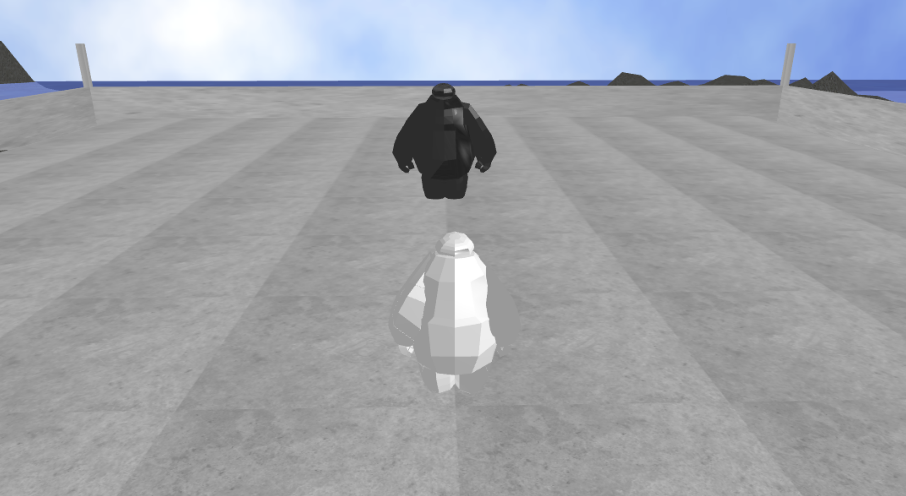

# CS174A - Computer Graphics Project
## Arena Battle

## Introduction
### Group Members

Kevin Yao - 20551530

Gaohong Liu - 705352121

Xilai Zhang - 804796478

Atharv Sakhala

### Background
When we first started the project, we were interested in creating a game, and in the end, we decided to create something akin to an arena battle, that was in part inspired by a simple tournament stage.

## Features
- [x] First Person Camera
- [x] Third Person Camera
- [x] Simple Water
- [x] Terrain and Bump Mapping
- [x] Collision Detection
- [x] Character Modeling and Movement
- [x] Advanced Shapes

## Terrain
To generate the terrain, we used a mixture of utilization of a height-map to create a shape for the ground, and the utilization of bump-mapping to give the ground more texture.
This is the height-map that was used.

The way we rendered it was that black was given a value of 0, and white was given the highest value. After calculating the pixel value of each section, we converted that into a y value for each of the x,z coordinates thus providing the shape we needed. We wanted a more even ground for the island, so we had created a relatively smooth ground while allowing some of the bumpy features to come out.

###Difficulties
One of the main difficulties that occured was mapping the height-map correctly to each point in the corresponding world, there are still some issues on accuracy due to the way points are connected, which doesn't allow for smooth movement between different heights

## Camera
### First Person Camera

### Third Person Camera

The main difficulties involved in creating this was the angle and aim of the camera. I had to track the movement of the camera around the head, so that the body wouldn't show up in this view but still stay in front of the player

## Water

There were some difficulties in getting the water to be the correct level of transparency and texture. In the end we created a custom shader for the water to make it semi-transparent and used an image to give it the visual effects of water as well as the color.

##Collision Detection

We added in a firing mechanism that allows for a sword to be fired on click, or if desired an entire array of swords to be fired at a training dummy we setup in the middle of the arena. Whenever a sword collides with the character, it will stop it's movement and stay for the entire duration of it's lifespan.

### Difficulties
With the way the tiny-graphics worked, shapes and objects aren't stored anywhere, they are just drawn and forgotten. Thus we have to manually calculate if each object (the sword and the dummy) had intersecting spaces.
Due to the fact that the shapes weren't standard, it became difficult to calculate the exact dimensions, and in the end we opted to have a cube hitbox around the dummy, and have each sword act as a point in space.

Given more time, we could have added a more comprehensive hitbox for each sword, limb and other areas like with the walls and floors.

## Character Modeling and Movement
Our characters were modeled mainly after Baymax from Big Hero Six. The shape and dimensions of the character made a distinctive shape and it was a character that we all liked. At first the model and shape only consisted of different spheres, but eventually we decided to use different obj's to imitate different parts of baymax's body.
We seperated the head, torso, arms, and legs into their own seperate object, thus opening the possibilities of moving arms and legs while walking. We added in some minor movements to the object to allow for a semblence of walking, as opposed to just floating across the world.

We also added in a simple jump mechanic, the character is being held down to the floor by a semblence of gravity, and is allowed to jump.

## Arena

The arena is mainily consisiting of a concrete texture. It is consisted of a mixture of cubes and a custon half torus. This gives the shape of a basic arena with a risen stage that the player can interact with.
